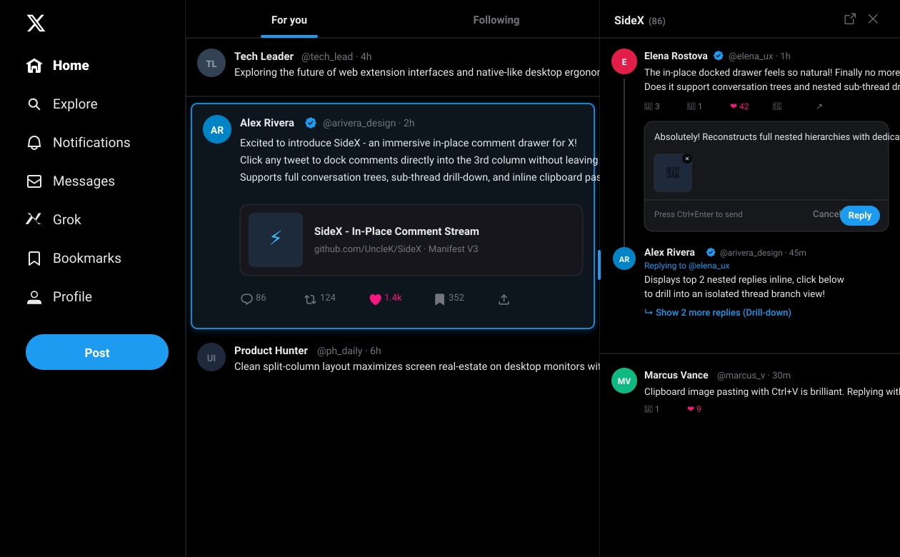

<div align="center">
  
  <h1>SideX</h1>
  <p><strong>Immersive In-Place Comment Stream &amp; Thread Drawer for X (Twitter)</strong></p>

  <p>
    <a href="README_CN.md">🇨🇳 简体中文</a> •
    <a href="#features">Features</a> •
    <a href="#installation">Installation</a> •
    <a href="#shortcuts">Shortcuts</a> •
    <a href="#license">License</a>
  </p>

  <p>
    
    
    
  </p>

  <br />
  
  <br /><br />
  
  <br />
</div>

---

## 📖 Overview

**SideX** transforms how you read X (Twitter) on the web. Instead of forcing a full-page navigation when clicking a post, SideX docks a minimalist comment stream directly into the right-hand column and expands the post in-place. Read threads, drill into sub-replies, and reply with images without ever losing your timeline scroll position.

---

## ✨ Features

* 🚀 **In-Place Drawer**: Click any tweet to dock its replies directly in the 3rd column—zero page redirects or reload.
* 📖 **Auto-Unroll Long Posts**: Automatically expands "Show more" on focal posts.
* 🧵 **Conversation Tree & Drill-down**: Reconstructs nested replies with clean thread lines; click to drill into sub-threads.
* 💬 **Inline Reply & Image Paste**: Reply to any comment in-place with `Ctrl+V` clipboard image pasting and `Ctrl+Enter` sending.
* 🔄 **Live Action Sync**: Like, repost, and bookmark from the drawer with instant bidirectional sync.
* 🎨 **Adaptive Themes & Resizable**: Matches X's Light, Dim, and Dark themes. Drag the right edge to adjust sidebar width.
* 🛡️ **Zero Ban Risk**: 100% client-side. Reuses your active browser session and official signing tokens without headless bot footprints.

---

## 📦 Installation

Compatible with Chrome, Edge, Brave, Arc, and other Chromium browsers:

1. **Clone or download this repo**:
   ```bash
   git clone https://github.com/UncleK/SideX.git
   ```
2. **Open your browser extension manager**:
   * Chrome / Brave: `chrome://extensions/`
   * Edge: `edge://extensions/`
3. **Turn on "Developer mode"** in the top-right corner.
4. **Click "Load unpacked"** and select the `SideX` folder.
5. Open [x.com](https://x.com) or [twitter.com](https://twitter.com) and click any tweet to start reading!

---

## ⌨️ Shortcuts

| Shortcut / Action | Description |
| :--- | :--- |
| **Click Tweet body** | Expand post text & open comments drawer in-place |
| **ESC** | Close image lightbox, or close comments drawer |
| **Click outside drawer** | Close comments drawer |
| **Drag right edge** | Resize drawer width (auto-saved) |
| **Double-click handle** | Reset drawer to default width |
| **Ctrl + V** | Paste clipboard image directly into reply box |
| **Ctrl + Enter** | Send reply |

---

## ⚠️ Disclaimer

SideX is an independent open-source productivity extension and is **not affiliated with, endorsed by, or associated with X Corp. or Twitter**.

---

## 📄 License

[MIT License](LICENSE) © 2026 SideX Contributors
